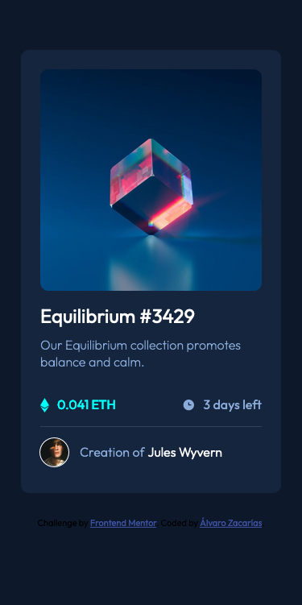
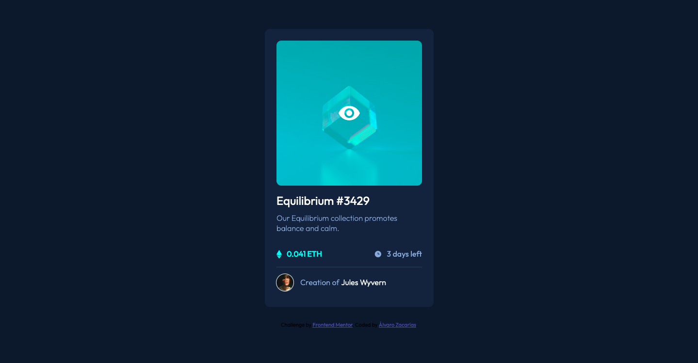
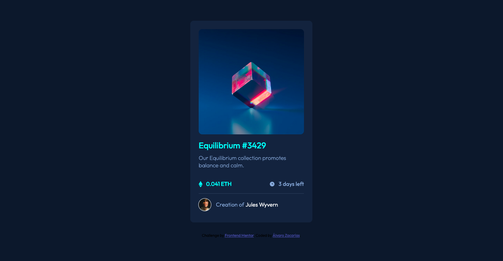
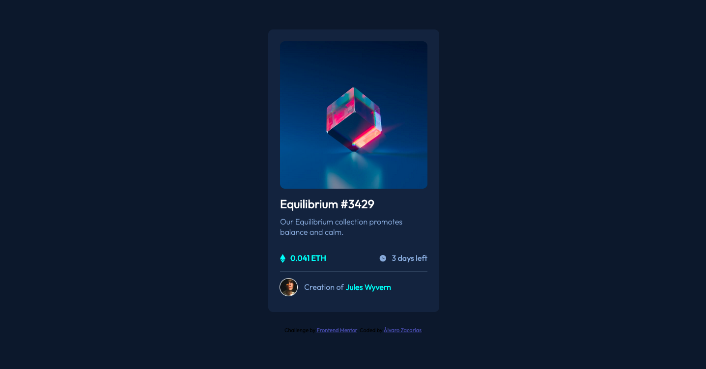

# Frontend Mentor - NFT preview card component solution

This is a solution to the [NFT preview card component challenge on Frontend Mentor](https://www.frontendmentor.io/challenges/nft-preview-card-component-SbdUL_w0U). Frontend Mentor challenges help you improve your coding skills by building realistic projects. 

## Table of contents

- [Overview](#overview)
  - [The challenge](#the-challenge)
  - [Screenshot](#screenshot)
  - [Links](#links)
- [My process](#my-process)
  - [Built with](#built-with)
  - [What I learned](#what-i-learned)
  - [Continued development](#continued-development)
  - [Useful resources](#useful-resources)
- [Author](#author)

## Overview

### The challenge

Users should be able to:

- View the optimal layout depending on their device's screen size
- See hover states for interactive elements

### Screenshot

### Links

- Solution URL: [https://github.com/alvarozama/NFT-preview-card-component]
- Live Site URL: [https://alvarozama.github.io/NFT-preview-card-component/]

## My process

### Built with

- Semantic HTML5 markup
- CSS custom properties
- Flexbox
- Mobile-first workflow

### What I learned

I pretty much learned about CSS methodologies, which I had not heard of before prior to this. I had seen code snippets full of double dashes and double underscores, but I didn't understand what that was about. Now I know it's the BEM methodology.

### Continued development

I haven't fully wrapped my head around BEM concepts, specially the Modifier part, so I'd like to keep delving into the subject to further understand the usage of blocks, elements and modifiers. This all seems to be particullarly useful when working with SASS, so I'd like to learn how to use that as well.

### Useful resources

- [Dimitry Mayorov on BEM](https://youtu.be/YktyUS1Aeo0?si=L0QMCxxsNh87ARja) - YouTube video explaining the logic behind the BEM methodology and why it's convenient to use over pure, raw CSS selecting.
- [Design Course on BEM](https://youtu.be/er1JEDuPbZQ?si=bmYBDv7TmKKC2aCj) - Same as the above link.
- [Kevin Powell on BEM](https://youtu.be/SLjHSVwXYq4?si=91yidf2bV6muVX-J) - Same as above.

## Author

- Frontend Mentor - [@alvarozama](https://www.frontendmentor.io/profile/alvarozama)
